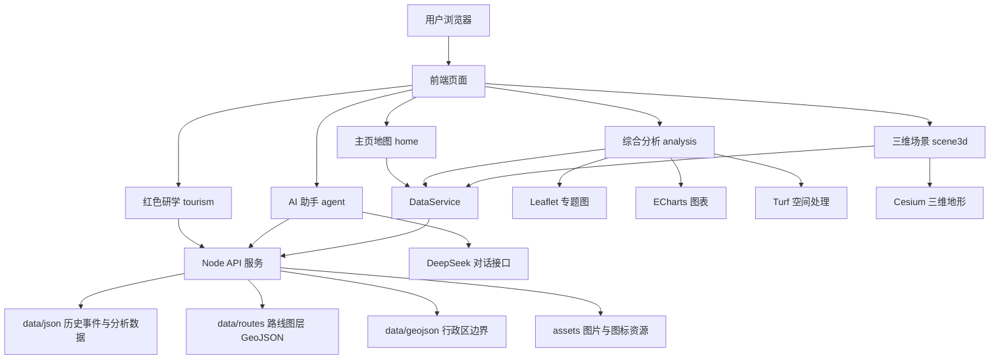

# 红图绘长征 / Long March WebGIS 项目总文档与技术路线

## 1. 项目概述

红图绘长征 / Long March WebGIS 是一个面向测绘技能竞赛、红色研学展示和长征历史空间叙事的 WebGIS 项目。系统以长征路线为主线，整合历史事件、红色资源、地形环境、专题分析、三维场景和 AI 问答，形成二维地图叙事、GIS 专题分析、三维核心场景、红色研学路线和 AI 助手的一体化展示平台。

项目当前采用轻量化 Node.js 服务和静态 JSON 数据驱动，前端通过 Leaflet、Cesium、Turf、ECharts 等库完成地图表达、空间分析和图表可视化。整体结构适合比赛现场演示，也预留了迁移到数据库、PostGIS、ArcGIS Pro 成果服务和真实三维模型的扩展路径。

## 2. 建设目标

1. 构建可交互的长征路线 WebGIS 展示平台，支持路线分层、事件播放、节点筛选和叙事联动。
2. 将历史事件、路线轨迹、红色资源点、地形环境和省域统计整合到统一空间表达中。
3. 提供 GIS 专题分析能力，包括路线统计、地形剖面、缓冲区、节点类型、资源关联和难度指数。
4. 通过 Cesium 构建遵义会议核心三维场景，强化重点历史节点的空间沉浸感。
5. 面向红色研学应用，自动生成不同主题、不同天数的研学路线方案。
6. 接入 AI 助手，辅助解释 GIS 分析结果、页面信息和研学内容。
7. 形成可扩展架构，后续可平滑接入 PostGIS、ArcGIS 服务、真实 DEM 和 3DGS/GLB 模型。

## 3. 用户与场景

| 用户类型 | 主要需求 | 对应功能 |
| --- | --- | --- |
| 竞赛评委 | 快速理解项目亮点、技术路线和测绘能力 | 首页地图演示、分析页、三维场景、答辩功能清单 |
| 教师/学生 | 了解长征历史节点与空间分布 | 时间线、事件卡片、路线动画、诗词模块 |
| 红色研学组织者 | 设计研学路线和现场教学方案 | 红色研学资源筛选、研学路线生成、知识图谱 |
| GIS 开发者 | 复用数据服务和空间分析架构 | API、DataService、路线图层、分析 JSON |
| 后续维护者 | 增加数据、替换底图、升级数据库 | 模块化目录、配置文件、扩展路线 |

## 4. 系统总体架构



系统采用前端功能模块、后端功能模块和共享能力的组织方式。每个业务功能在 `features/{feature}/frontend` 和 `features/{feature}/backend` 下独立维护，共享配置、数据服务和公共工具放在 `features/shared`。

## 5. 技术栈

| 层级 | 技术/工具 | 作用 |
| --- | --- | --- |
| 服务端 | Node.js 原生 HTTP | 托管静态页面、分发 API、读取 JSON 数据 |
| 前端地图 | Leaflet 1.9.4 | 二维底图、路线、节点、资源点、专题图层 |
| 三维场景 | CesiumJS 1.127 | 三维地球、地形、路线、核心点和镜头控制 |
| 空间分析 | Turf.js | 前端缓冲区、距离、空间关系等轻量分析 |
| 图表表达 | ECharts 5.5.0 | 统计图、对比图、剖面图和分析结果表达 |
| 数据格式 | JSON / GeoJSON | 历史事件、路线图层、资源点、分析结果 |
| AI 能力 | DeepSeek Chat API | 页面问答、分析解释、研学内容辅助 |
| 脚本工具 | Python / Node 脚本 | 静态 SHP 数据生成、GIS 分析数据生成、CSS 格式化 |
| 未来扩展 | PostgreSQL/PostGIS、ArcGIS Pro、CGCS2000 | 生产级空间数据管理、分析服务和坐标基准 |

## 6. 项目目录说明

| 目录/文件 | 说明 |
| --- | --- |
| `server/app.js` | Node 服务入口，负责 API 分发和静态文件托管 |
| `features/home` | 首页主地图，包含路线图层、事件播放、资源展示和诗词入口 |
| `features/analysis` | 综合 GIS 分析页，包含专题地图、分析工具、图表和结论 |
| `features/scene3d` | Cesium 三维场景，聚焦遵义会议核心节点 |
| `features/tourism` | 红色研学/旅游模块，支持资源筛选和路线方案生成 |
| `features/poetry` | 长征诗词展示、朗读和地图联动 |
| `features/agent` | AI 助手前端面板与后端对话接口 |
| `features/shared` | 共享配置、数据服务、地图工具、HTTP 工具、静态文件工具 |
| `data/json` | 历史事件、红色资源、分析结果、三维焦点等 JSON 数据 |
| `data/routes` | 路线配置和各路线 GeoJSON 图层 |
| `data/geojson` | 中国省级行政区 GeoJSON |
| `assets/images` | 首页、诗词、三维场景、旅游模块等图片资源 |
| `gis-analysis` | GIS 分析脚本和地形瓦片缓存 |
| `scripts` | 数据生成与格式化脚本 |
| `docs` | 项目说明、接口说明、数据说明、答辩说明等文档 |

## 7. 功能模块说明

### 7.1 系统入口

系统默认访问 `/` 时直接进入首页主地图，并可通过页面导航访问综合分析、红色研学和三维场景。

| 访问路径 | 页面 |
| --- | --- |
| `/`、`/index.html`、`/zhuye.html` | 首页主地图 |
| `/analysis.html`、`/fenxi.html` | 综合分析页 |
| `/tourism.html`、`/red-tourism.html` | 红色研学页 |
| `/scene3d.html`、`/sanwei-changjing.html` | 三维场景页 |

### 7.2 首页主地图

首页是项目的核心叙事界面，负责把长征路线、重要事件和红色资源组织成可播放、可筛选、可联动的地图故事。核心能力包括路线分层展示、事件时间线排序、阶段和类型筛选、路线动画、节点详情联动、底图切换、诗词展示和语音朗读。

### 7.3 综合 GIS 分析

综合分析页面面向测绘竞赛展示，重点表达数据如何被分析、空间规律如何被解释、结论如何被可视化。

| 分析工具 | 说明 |
| --- | --- |
| 路线统计 | 统计不同路线里程、节点数量、资源关联等指标 |
| 多路线对比 | 对比不同红军路线的空间结构和数据密度 |
| 地形难度指数 | 综合高程、坡度、高差和特殊地形节点形成难度表达 |
| 地形剖面 | 展示路线沿线海拔变化和典型困难地段 |
| 缓冲区分析 | 预设 5km、10km、20km 圈层，用于研学可达性和资源集聚分析 |
| 节点类型统计 | 统计会议、战斗、渡江、雪山草地、会师等类型分布 |
| 红色资源关联 | 分析路线周边纪念馆、旧址、景区和遗址的空间关系 |

表达方式包括 Leaflet 专题图层、Turf 轻量空间计算、ECharts 图表和自动分析结论。`/api/analysis/insight` 为每类分析提供展示性说明，适合答辩讲解使用。

### 7.4 三维场景

三维场景使用 CesiumJS 构建，以遵义会议为核心点，展示路线在三维地形中的空间关系。当前支持三维地球、地形、路线、核心点、辅助节点、光柱、标签、地形夸张、图层开关、测距、点击拾取和镜头飞行。`scene3d-focus.json` 管理核心点位、说明、图片和模型预留字段。

### 7.5 红色研学/旅游

红色研学模块面向真实应用延展，基于红色资源点自动构建主题研学路线。系统支持省份、类型、关键词筛选，提供长征转折会议、渡江战斗、雪山草地、纪念馆研学等主题，并可根据天数、主题、资源点和地理距离生成每日行程、交通衔接、停留时间、餐饮建议、天气建议和关联事件。

### 7.6 AI 助手

AI 助手作为悬浮面板集成在页面中，后端通过 `/api/agent/chat` 调用 DeepSeek Chat API。它可以接收用户问题和历史上下文，也可以携带当前页面 GIS 分析上下文，用于解释图表、结论和研学内容。真实 API Key 应只保存在 `.env` 或服务器环境变量中，不应写入前端代码或提交到公开仓库。

## 8. 后端接口汇总

所有成功响应统一为 `{ code: 200, message: success, data: ... }`。

| 接口 | 方法 | 说明 |
| --- | --- | --- |
| `/api/health` | GET | 服务健康检查 |
| `/api/events` | GET | 重要历史事件 GeoJSON |
| `/api/events/timeline` | GET | 按时间排序的事件时间线 |
| `/api/routes` | GET | 总体路线数据 |
| `/api/resources` | GET | 红色资源点数据 |
| `/api/red-tourism/resources` | GET | 红色研学资源数据 |
| `/api/route-layers` | GET | 路线图层配置 |
| `/api/route-layers/{layerKey}/features` | GET | 指定路线图层 GeoJSON |
| `/api/route-layers/{layerKey}/animation` | GET | 指定路线动画数据 |
| `/api/analysis/summary` | GET | 综合分析摘要 |
| `/api/analysis/province` | GET | 省域统计 |
| `/api/analysis/elevation` | GET | 海拔剖面 |
| `/api/analysis/buffer` | GET | 缓冲区分析 |
| `/api/analysis/stage` | GET | 阶段统计 |
| `/api/analysis/node-types` | GET | 节点类型统计 |
| `/api/analysis/routes` | GET | 路线分析 |
| `/api/analysis/difficulty` | GET | 地形难度指数 |
| `/api/analysis/route-compare` | GET | 多路线对比 |
| `/api/analysis/insight?tool=&route=` | GET | 分析解释文本 |
| `/api/analysis/buffer/layers/core-5km` | GET | 5km 缓冲图层预留接口 |
| `/api/analysis/buffer/layers/traffic-10km` | GET | 10km 缓冲图层预留接口 |
| `/api/analysis/buffer/layers/region-20km` | GET | 20km 缓冲图层预留接口 |
| `/api/scene3d/focus` | GET | 三维核心场景配置 |
| `/api/poetry/long-march` | GET | 长征诗词数据 |
| `/api/tourism/resources` | GET | 红色研学资源筛选 |
| `/api/tourism/options` | GET | 研学筛选选项 |
| `/api/tourism/study-route` | GET | 研学路线方案 |
| `/api/tourism/knowledge-graph` | GET | 研学知识图谱 |
| `/api/agent/chat` | POST | AI 助手对话 |

## 9. 数据组织与字段

| 数据目录 | 内容 |
| --- | --- |
| `data/json` | 事件、资源、分析结果、诗词、三维焦点等业务数据 |
| `data/routes` | 路线配置和各路线 GeoJSON 图层 |
| `data/routes/route-layers` | 各部队路线独立图层 |
| `data/geojson` | 中国省级行政区边界 |
| `gis-analysis/cache/terrarium` | Terrarium DEM 地形瓦片缓存 |

历史节点常用字段包括 `id`、`name`、`date`、`type`、`stage`、`province`、`city`、`lat`、`lng`、`importance`、`description`。Leaflet 页面显示常用 `[纬度, 经度]`，GeoJSON 标准坐标为 `[经度, 纬度]`。后续生产级数据建议统一采用 CGCS2000 坐标基准，并在入库前完成坐标转换和拓扑检查。

## 10. 技术路线

```text
多源历史资料整理
→ 地理编码与坐标清洗
→ CGCS2000 / GeoJSON 空间化
→ 静态 JSON 与路线图层组织
→ Node.js API 数据服务
→ Leaflet 二维路线动态演绎
→ Turf / ECharts 专题空间分析表达
→ Cesium 三维核心场景展示
→ 红色研学路线智能生成
→ AI 助手解释与答疑
→ PostGIS / ArcGIS / 3DGS 扩展
```

### 10.1 数据处理路线

1. 整理长征历史事件、路线节点、部队路线、红色资源和重要场景资料。
2. 对事件和资源进行地名标准化、经纬度补全、字段清洗和类型编码。
3. 将路线数据转换为 GeoJSON，按部队或线路拆分为独立图层。
4. 将分析结果整理为 JSON，供前端直接读取或由 API 返回。
5. 通过 `scripts/generate-static-shp-data.py` 和 `gis-analysis/run-analysis.js` 支持后续数据再生成。

### 10.2 前端展示路线

1. `config.js` 统一管理 API 路径、静态数据路径、地图中心、底图和三维地形配置。
2. `DataService` 根据 `dataMode` 决定读取后端 API 或静态 JSON。
3. Leaflet 负责二维地图、路线、事件、资源点、弹窗和专题图层。
4. ECharts 负责统计图表和分析对比表达。
5. Cesium 负责三维地形、空间档案、核心点和测距交互。
6. 各页面通过模块内 JS 管理状态和交互，避免不同功能互相耦合。

### 10.3 后端服务路线

1. `server/app.js` 创建 Node HTTP 服务。
2. 后端按模块注册 API 处理器，包括 `home`、`analysis`、`scene3d`、`tourism`、`poetry`、`agent`。
3. `features/shared/backend/data-store.js` 统一读取 `data` 下的 JSON 和路线图层。
4. `features/shared/backend/static-files.js` 统一处理页面别名、静态资源映射和 MIME 类型。
5. API 成功响应统一为 `{ code, message, data }`，便于前端封装。

### 10.4 GIS 分析路线

1. 路线统计：基于路线长度、节点数量、资源数量和阶段结构生成指标。
2. 地形分析：结合 DEM/海拔数据形成剖面和起伏特征。
3. 难度评价：综合高差、坡度、特殊地形和历史节点形成难度指数。
4. 缓冲分析：以路线为中心构建 5km、10km、20km 多尺度服务圈层。
5. 节点分析：统计会议、战斗、渡江、雪山草地、会师等事件类型。
6. 资源关联：分析纪念馆、旧址、景区等资源与长征路线之间的空间关系。
7. 成果表达：专题地图 + 指标卡 + 统计图表 + 文字结论联动展示。

### 10.5 三维建设路线

1. 当前阶段：Cesium 地形 + 路线折线 + 核心点光柱 + 图片档案。
2. 增强阶段：接入真实 DEM、倾斜摄影、GLB 模型或 3DGS 模型。
3. 深化阶段：围绕遵义会议、泸定桥、雪山草地等重点场景建设多核心三维场景。
4. 应用阶段：支持场景漫游、历史讲解点、研学任务点和三维测量。

### 10.6 AI 与知识服务路线

1. 当前通过 DeepSeek Chat API 提供通用问答和页面上下文解释。
2. 研学模块内置轻量知识图谱模型，表达路线、事件、资源、精神谱系和研学任务关系。
3. 后续可将事件、人物、地点、文献和资源构建为图数据库或向量库。
4. AI 助手可进一步支持根据当前地图视角解释空间规律、根据路线生成讲解稿、根据分析结果生成答辩话术。

## 11. 运行与部署

本地运行：进入项目根目录后执行 `npm.cmd start`，默认访问 `http://localhost:8096`。如需更换端口，可设置 `PORT` 环境变量后执行 `node server/app.js`。

`.env.example` 示例：

```text
DEEPSEEK_API_KEY=your_deepseek_api_key
DEEPSEEK_MODEL=deepseek-chat
```

建议 `.env` 只保存在本地或服务器，不上传公开仓库。比赛现场如果网络不稳定，AI 助手可作为可选功能，不影响地图和分析主流程。

部署方式：安装 Node.js 18 或以上版本，上传项目文件，配置 `.env`，执行 `npm install`，再执行 `npm start` 或使用进程管理工具托管 `node server/app.js`，最后通过 Nginx 或校园网服务器反向代理到指定端口。

## 12. 当前优势

1. 主题明确：围绕长征历史空间叙事，符合红色文化和测绘竞赛主题。
2. 功能完整：覆盖二维地图、三维场景、GIS 分析、研学路线和 AI 助手。
3. 架构轻量：无复杂构建依赖，适合现场演示和快速部署。
4. 数据清晰：路线、事件、资源、分析结果分目录管理，便于维护。
5. 扩展性好：前端 DataService 已区分静态数据和 API 模式，后续可接数据库。
6. 表达丰富：地图、图表、动画、三维、诗词、研学方案形成多层次展示。

## 13. 后续升级路线

### 第一阶段：数据规范化

1. 完善所有事件和资源点的来源、坐标精度、行政区划和类型编码。
2. 建立统一数据字典，规范事件类型、阶段、重要性、资源分类。
3. 对路线 GeoJSON 进行拓扑检查、简化和分段编码。
4. 输出标准元数据说明，明确数据来源、采集时间和处理方法。

### 第二阶段：空间数据库升级

1. 将 `events`、`resources`、`routes`、`analysis_results` 等数据迁入 PostgreSQL/PostGIS。
2. 建立空间索引，提高路线查询、缓冲分析和邻近分析效率。
3. 后端 API 从读取 JSON 升级为数据库查询。
4. 支持按空间范围、时间范围、事件类型和路线 ID 动态查询。

### 第三阶段：专业 GIS 分析增强

1. 使用 ArcGIS Pro 或 PostGIS 生成正式缓冲区、核密度、服务区和叠加分析成果。
2. 接入道路交通、行政区、DEM、土地覆盖、景区服务设施等多源数据。
3. 完成行军阻力模型、可达性模型和研学资源适宜性评价模型。
4. 输出可下载的专题图、统计表和分析报告。

### 第四阶段：三维场景深化

1. 为遵义会议会址、泸定桥、雪山草地等重点节点建设真实三维模型。
2. 接入 3DGS、GLB、倾斜摄影或 Cesium 3D Tiles。
3. 增加历史场景讲解、三维路径漫游和重点节点复原。
4. 支持三维中点击节点联动二维地图和研学路线。

### 第五阶段：AI 知识服务升级

1. 建立长征知识库，整合人物、事件、地点、文献、图片和讲解稿。
2. 增加检索增强生成能力，减少 AI 编造风险。
3. 支持根据当前分析工具自动生成答辩讲稿、研学讲解词和结论摘要。
4. 支持教师端/学生端不同问答风格。

## 14. 风险与注意事项

1. 在线底图、Cesium 资源和 AI API 依赖网络，比赛现场应提前准备离线或备用方案。
2. 坐标顺序需要严格区分 Leaflet `[lat, lng]` 和 GeoJSON `[lng, lat]`。
3. 当前部分分析结果为演示数据，正式成果需要补充数据来源、计算过程和精度说明。
4. API Key 等敏感信息应从源码中移除，统一使用 `.env` 或服务器环境变量。
5. 3D 模型和 DEM 数据体积较大，后续部署时需要考虑加载速度、缓存策略和浏览器性能。

## 15. 答辩展示建议

推荐演示顺序：打开首页，展示长征路线总体分布；打开路线图层，演示多部队路线分层；播放中央红军路线动画，讲解时间线、节点和详情卡片联动；切换到综合分析页，展示路线统计、地形剖面、缓冲区和资源关联；从遵义会议节点进入三维场景，展示 Cesium 地形、核心点和测距交互；进入红色研学页，按主题生成一条研学路线方案；最后打开 AI 助手，演示对当前分析结果的解释能力。

## 16. 一句话总结

本项目以长征历史为内容主线，以 WebGIS 为技术底座，以路线、事件、资源、地形、三维场景和 AI 解释为表达手段，形成了一个兼具竞赛展示、红色研学和后续扩展价值的长征空间叙事平台。
